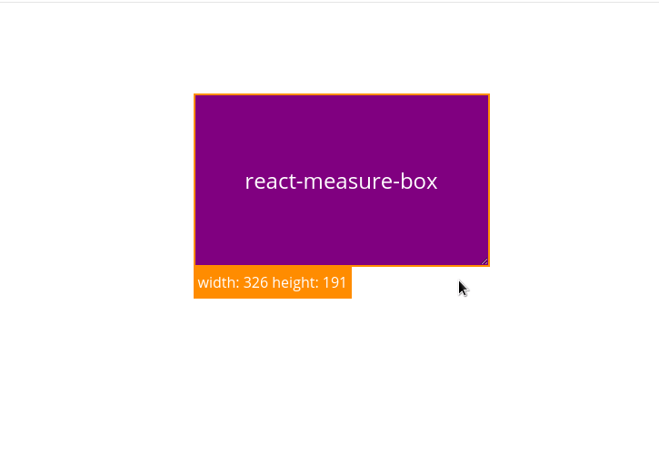

# react-measure-box

[](https://badge.fury.io/js/react-measure-box)

Test the responsive behavior of your react components.

This component was created for use with the storybook. It provides a convenient way to test the responsive behavior of your components.



## Installation

```bash
npm install --save 'measure-box-react'

yarn add 'measure-box-react'
```

## Basic usage

Just wrap your component with **\<MeasureBox\>** component:

```react
import MeasureBox from 'measure-box-react'

<MeasureBox>
  <YourReactComponent/>
</MeasureBox>
```

## Available props

#### children: ReactElement;

MeasureBox must receive the children element to measure.

#### resizable?: 'both' | 'horizontal' | 'vertical';

The ways you want to resize your box. If not given the box will not be resizable.

#### color?: string;

Color of the box border. Orange by default.

#### height?: string;

Optional height of the box.

#### width?: string;

Optional width of the box.

#### className?: string

Optional styles class for the component.
